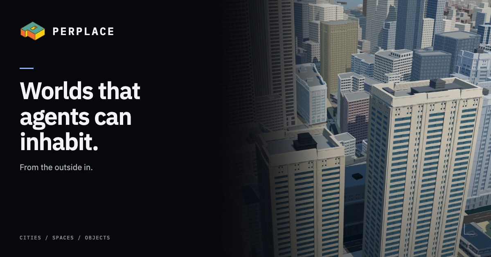
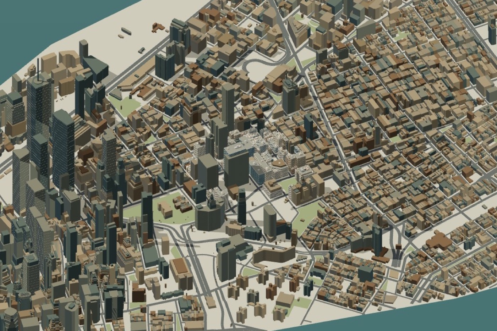
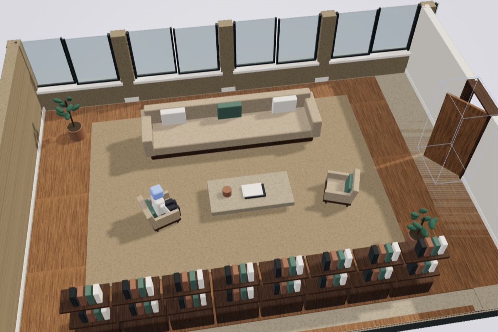
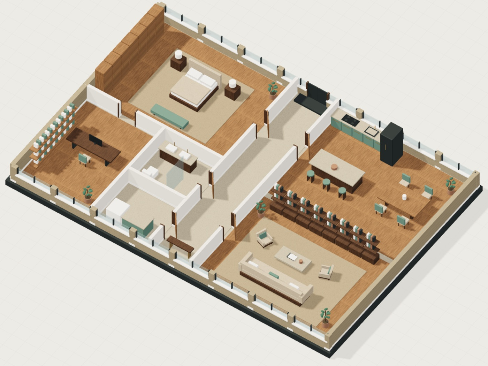
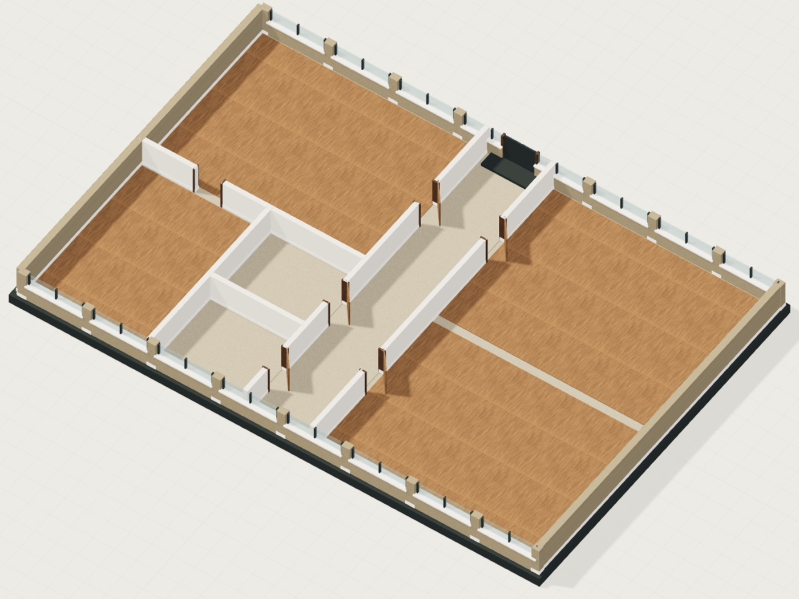

<p align="center">
  <a href="https://www.perplace.com"></a>
</p>

<p align="center">
  <a href="https://www.perplace.com">Product</a> ·
  <a href="https://www.perplace.com/docs/">Data model</a> ·
  <a href="https://www.perplace.com/changelog/">Work log</a> ·
  <a href="https://www.perplace.com/#early-access">Early access</a>
</p>

<br>

**Perplace turns an area, a reference or a description into a 3D world born structured and typed.** Every building can be entered. Everything is interactive. The same world runs in a game engine, a simulator or an agent evaluation loop, because it ships as data first and pixels second.

<br>

## One world, from the outside in

<table>
  <tr>
    <td width="33%" valign="top">
      
      <h3>Cities</h3>
      <p>From the skyline to the street. Start from a real area or imagine a new setting; shape the character of a place, then work on the buildings that give it identity.</p>
    </td>
    <td width="33%" valign="top">
      
      <h3>Spaces</h3>
      <p>A world with places inside. Go beyond the exterior: rooms, entrances and the spaces that connect them, with doors that open and windows that look out.</p>
    </td>
    <td width="33%" valign="top">
      
      <h3>Objects</h3>
      <p>Spaces with a purpose. Furniture, objects and uses that your application can work with: sit, lie down, open, pick up, put down.</p>
    </td>
  </tr>
</table>

<br>

## A chair is more than a shape in a room

A convincing image does not tell an agent what a place is, what connects to it or how to use it. Perplace gives the world that meaning alongside its appearance. *"Go to the armchair in the living room"* is answerable because the place, the object and its use are part of the world:

```json
{
  "id": "obj_armchair_1",
  "name": { "en": "armchair", "es": "sillón" },
  "room": "living",
  "uses": ["sit"],
  "agent": { "seat": [7.1, 0.45, 5.6], "facing": [0, 0, -1], "approach": "front" },
  "mobility": { "kind": "movable", "massKg": 24 },
  "collision": { "blocks": true, "walkable": false }
}
```

Doors keep the state the last action left them in. Seats are entered through their access point. Footprints are never ignored when planning: if there is no free path, the agent stays put and says so. These are guarantees of the data, not tricks of the demo.

<br>

## Designed with intelligence. Built with structure. Refined through review.

Two AI agents work together: an architect who interprets your references and directs the design, and an independent visual judge who evaluates the result. Procedural tools build the world between them and check its geometry and spatial relationships. The cycle (design, build, evaluate, refine) is automated, and every change is local: you direct the overall character, refine a facade or rethink a room, and the rest of your world stays as you left it.

<p align="center">
  
</p>

<br>

## Delivered the way your engine reads it

| Format | What it contains |
|---|---|
| **JSON** | The structured world: entity list, object records and the room tree. |
| **USD** | One transform per object with the Perplace attributes, rooms with their bounds, provenance hash of the source. |
| **glTF / GLB** | The visual scene for engines and DCC tools. |
| **Simulation grids** | Walkable and blocked cells derived from the collision pieces, at the resolution you request. |

Blender, Unreal Engine, Unity, Godot, Houdini, Omniverse and three.js read at least one of them. Materials are named, not baked. Collision is convex as is. No physics is baked: mass and states travel as data for whoever simulates.

<br>

## Private beta

Perplace is in private beta with a handful of paid pilots. The source stays private; this organization hosts what we publish for integrators as it becomes stable.

<p align="center">
  <a href="https://www.perplace.com/#early-access"><b>Request early access →</b></a><br>
  <sub>hello@perplace.com</sub>
</p>
